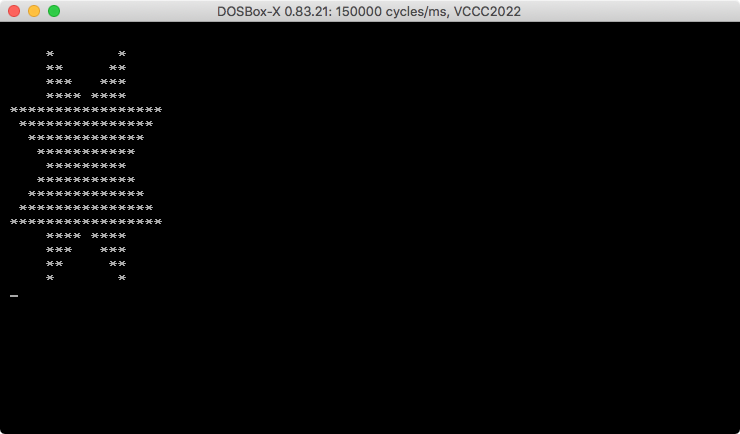

# Sizecoding

Demoscene-ish tiny intros and other sizecoding experiments in x86 assembly language.

Assemble with [nasm](https://www.nasm.us/) or use the provided `build.sh` bash script.

## minfire

A good looking fire effect in 64 bytes. Released at Lovebyte Party 2022. Ranked 9th in the high-end 64-byte intro compo.

[Pouet](https://www.pouet.net/prod.php?which=90974) | [Demozoo](https://demozoo.org/productions/305327/) | [Video](https://github.com/xeleh/sizecoding/raw/main/minfire/minfire.mp4) | [Source](https://github.com/xeleh/sizecoding/blob/main/minfire/minfire.asm)

## ffzoomer

A variation of the chaos/dweezil zoomer in 127 bytes. Released at Lovebyte Party 2022. Ranked 5th in the high-end 128-byte intro compo.

[Pouet](https://www.pouet.net/prod.php?which=90976) | [Demozoo](https://demozoo.org/productions/305356/) | [Video](https://github.com/xeleh/sizecoding/raw/main/ffzoomer/ffzoomer.mp4) | [Source](https://github.com/xeleh/sizecoding/blob/main/ffzoomer/ffzoomer.asm)

## vccc2022

My (non submitted) entry for the [Vintage Computing Christmas Challenge 2022](https://logiker.com/Vintage-Computing-Christmas-Challenge-2022). 50 bytes, x86 assembly, DOSBox.

[Source](vccc2022/v7.asm)

