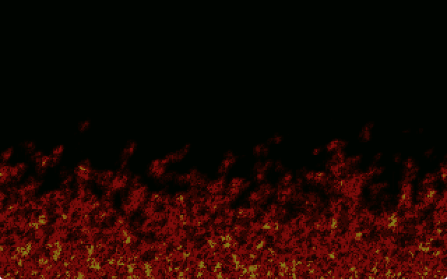
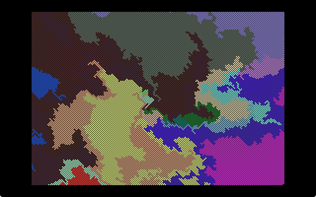
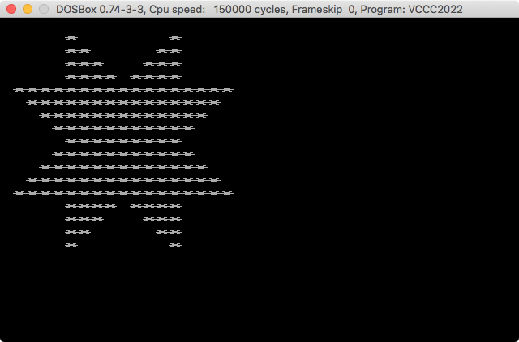

# Sizecoding

Demoscene-ish tiny intros and other sizecoding experiments in x86 assembly language.

Use the `build.sh` script in each folder to build the binaries.

## matrixh

The classic Matrix digital rain effect in 128 bytes. Released at Lovebyte Party 2025. Ranked 12th in the high-end 128-byte intro compo.

[Pouet](https://www.pouet.net/prod.php?which=103653) | [Demozoo](https://demozoo.org/productions/367739/) | [Source](matrixh/v2.asm)

https://github.com/user-attachments/assets/f95842f3-0026-4ae9-b489-f83b17182fde

## minfire

A good looking fire effect in 64 bytes. Released at Lovebyte Party 2022. Ranked 9th in the high-end 64-byte intro compo.

[Pouet](https://www.pouet.net/prod.php?which=90974) | [Demozoo](https://demozoo.org/productions/305327/) | [Video](https://github.com/xeleh/sizecoding/raw/main/minfire/minfire.mp4) | [Source](minfire/minfire.asm)

## ffzoomer

A variation of the chaos/dweezil zoomer in 127 bytes. Released at Lovebyte Party 2022. Ranked 5th in the high-end 128-byte intro compo.

[Pouet](https://www.pouet.net/prod.php?which=90976) | [Demozoo](https://demozoo.org/productions/305356/) | [Video](https://github.com/xeleh/sizecoding/raw/main/ffzoomer/ffzoomer.mp4) | [Source](ffzoomer/ffzoomer.asm)

## vccc

My entries for the [Vintage Computing Christmas Challenge](https://logiker.com/Vintage-Computing-Christmas-Challenge-2024).

|  |  |  |  |
| :-: | :-: | :-: | :-: |
|  |  |  |  | 
| [2022 (x86)](vccc/vccc2022/README.md) | [2023 (x86)](vccc/vccc2023/README.md) | [2023 (Amiga)](vccc/vccc2023#amiga--68-bytes-without-header-m68k-assembly) | [2024 (x86)](vccc/vccc2024/README.md) | 

