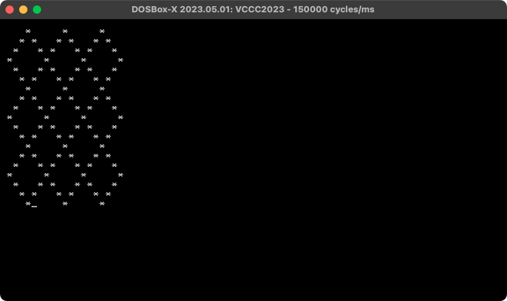
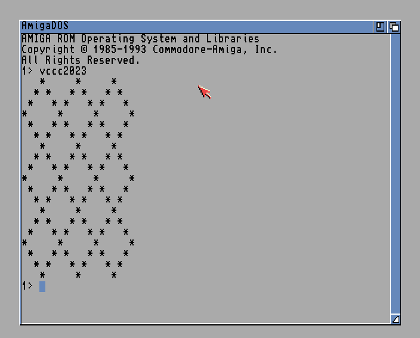
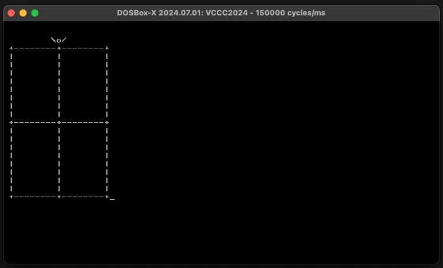

# Sizecoding

Demoscene-ish tiny intros and other sizecoding experiments in x86 assembly language.

Use the `build.sh` script in each folder to build the binaries.

## matrixh

The classic Matrix digital rain effect in 128 bytes. Released at Lovebyte Party 2025. Ranked 12th in the high-end 128-byte intro compo.

[Demozoo](https://demozoo.org/productions/367739/) | [Source](matrixh/v2.asm)

https://github.com/user-attachments/assets/f95842f3-0026-4ae9-b489-f83b17182fde

## minfire

A good looking fire effect in 64 bytes. Released at Lovebyte Party 2022. Ranked 9th in the high-end 64-byte intro compo.

[Pouet](https://www.pouet.net/prod.php?which=90974) | [Demozoo](https://demozoo.org/productions/305327/) | [Video](https://github.com/xeleh/sizecoding/raw/main/minfire/minfire.mp4) | [Source](https://github.com/xeleh/sizecoding/blob/main/minfire/minfire.asm)

## ffzoomer

A variation of the chaos/dweezil zoomer in 127 bytes. Released at Lovebyte Party 2022. Ranked 5th in the high-end 128-byte intro compo.

[Pouet](https://www.pouet.net/prod.php?which=90976) | [Demozoo](https://demozoo.org/productions/305356/) | [Video](https://github.com/xeleh/sizecoding/raw/main/ffzoomer/ffzoomer.mp4) | [Source](https://github.com/xeleh/sizecoding/blob/main/ffzoomer/ffzoomer.asm)

## vccc2022

My (non submitted) entry for the [Vintage Computing Christmas Challenge 2022](https://logiker.com/Vintage-Computing-Christmas-Challenge-2022).

#### PC : 50 bytes, x86 assembly | [Source](vccc2022/v7.asm)

## [vccc2023](vccc2023)

My entries for the [Vintage Computing Christmas Challenge 2023](https://logiker.com/Vintage-Computing-Christmas-Challenge-2023).

#### PC : 41 bytes, x86 assembly | [Source](vccc2023/x86/v5.asm)

#### Amiga : 68 bytes (without header), M68k assembly | [Source](vccc2023/amiga/v4.s)

## [vccc2024](vccc2024)

My entry for the [Vintage Computing Christmas Challenge 2024](https://logiker.com/Vintage-Computing-Christmas-Challenge-2024).

#### PC : 52 bytes, x86 assembly | [Source](vccc2024/v5.asm)

