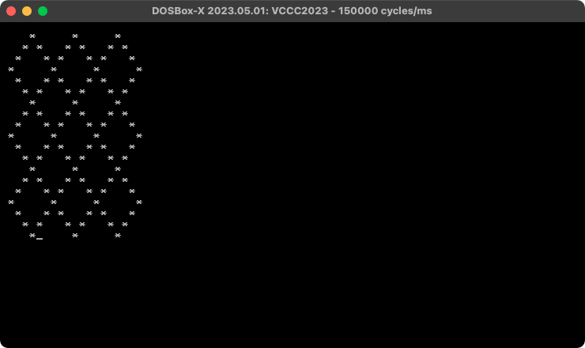
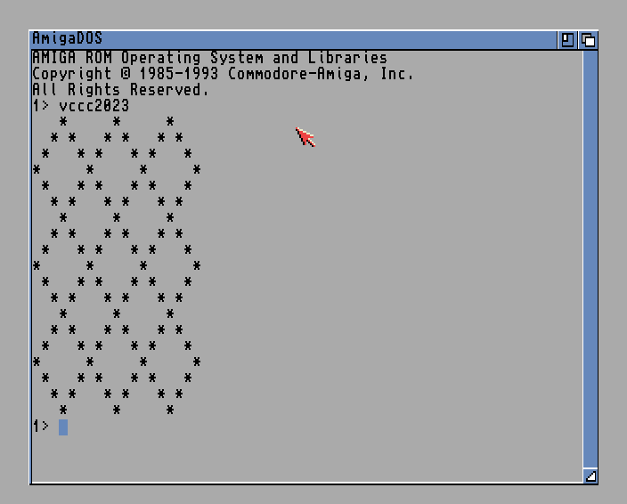

# vccc2023

My entries for the [Vintage Computing Christmas Challenge 2023](https://logiker.com/Vintage-Computing-Christmas-Challenge-2023).

## PC : 41 bytes, x86 assembly

| version | executable size |
| :-: | --: |
| [v1](x86/v1.asm) | 60 bytes |
| [v2](x86/v2.asm) | 52 bytes |
| [v3](x86/v3.asm) | 45 bytes |
| [v4](x86/v4.asm) | 42 bytes |
| **[v5](x86/v5.asm)** | **41 bytes** |

You can assemble each version by leaving the corresponding line uncommented in the `vccc2023.asm` file.

 

## Amiga : 68 bytes (without header), M68k assembly

| version | executable size |
| :-: | --: |
| [v1](amiga/v1.s) | 164 bytes (125 + 36 + 3) |
| [v2](amiga/v2.asm) | 120 bytes (82 + 36 + 2) |
| [v3](amiga/v3.asm) | 112 bytes (76 + 36 + 2) |
| **[v4](amiga/v4.asm)** | **104 bytes (68 + 36)** |

You can assemble each version by leaving the corresponding line uncommented in the `vccc2023.s` file.