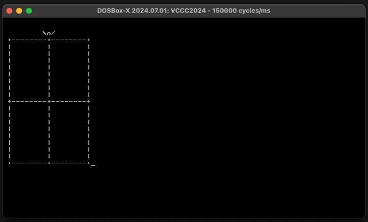

# vccc2024

My entry for the [Vintage Computing Christmas Challenge 2024](https://logiker.com/Vintage-Computing-Christmas-Challenge-2024).

## PC : 52 bytes, x86 assembly

| version | executable size |
| :-: | --: |
| [v1](v1.asm) | 63 bytes |
| [v2](v2.asm) | 59 bytes |
| [v2b](v2b.asm) | 56 bytes |
| [v3](v3.asm) | 55 bytes |
| [v4](v4.asm) | 54 bytes |
| **[v5](v5.asm)** | **52 bytes** |

You can assemble each version by leaving the corresponding line uncommented in the `vccc2024.asm` file.

