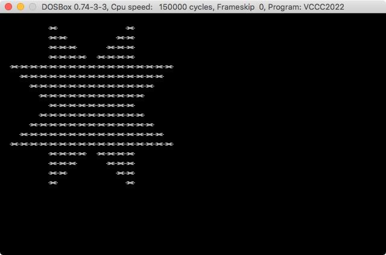

# vccc2022

My (non-submitted) entry for the [Vintage Computing Christmas Challenge 2022](https://logiker.com/Vintage-Computing-Christmas-Challenge-2022). I didn't submit this because to me this was more a personal challenge than a competition. I am quite happy with my results.

I coded an initial naive version (114 bytes) and then set my goal to getting something shorter than 100 bytes. After 4 more versions I ended with a 83 bytes .com file. Not that bad for this dinocoder! ;)

| version | executable size |
| :-: | --: |
| v1 | 114 bytes |
| v2 | 111 bytes |
| v3 | 100 bytes |
| v4 | 97 bytes |
| **v5** | **83 bytes** |

You can assemble each version by leaving the corresponding line uncommented in the `vccc2022.asm` file.